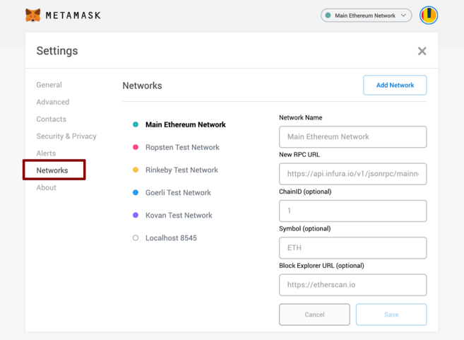

# Create a Wallet

To get started on FRZDEX, the first thing you'll need is to set up a wallet that supports adding custom EVM based blockchain . Wallets are available both on desktop computers and on smartphone devices. You'll need to choose the wallet that fits your needs best.


**When you're setting up a wallet, be sure to:**

* ✅ **Download and install only the latest version from an official source.**
* ✅ **Follow the setup guide carefully.**
* ✅ **Safely back up your recovery phrases.**
* ❌ **NEVER share your recovery phrases with anyone, under any circumstances.**
* ❌ **NEVER input your recovery phrase to a website or app, other than your wallet app.**


##

## Configure FRZ Smart Chain in the Metamask wallet

MetaMask is a very popular browser-based wallet plugin that supports ERC20 (Ethereum network) and other EVM based networks.

[**Download MetaMask**](https://metamask.io/download.html) (Automatically detects device)\
\
[**MetaMask Setup Guide**](https://docs.metamask.io/guide/)****\
****\
****After Metamask is installed, you will need to set-up the FRZ Smart Chain network.&#x20;

To do this, follow these steps:

1. Open _**Settings**_ page
2. Choose _**Network** _ section\
   ****\
   ********\
   ****
3. Click **Add Network** in the top-right corner to manually add the FRZ Smart Chain with following params:\
   \
   **Network name:** FRZ Smart Chain\
   **RPC:** https://mainnet.frzchain.com\
   **Chain ID:** 1995\
   **Symbol:** FRZSS\
   **Explorer link:** [https://explorer.frzchain.com/](https://explorer.frzchain.com/)

****\
****Once you **Save** the Network and return to the main view the network has automatically been set to the one you just entered, and the units are denominated in FRZSSMobile device wallets and desktop-based wallets have different strengths and weaknesses. Consider which fits your needs better to help decide which type of wallet to use.

## ****


NEVER, in any situation, should you ever give someone your private key or recovery phrase ("seed phrase"). This will give someone complete access to your crypto!

The genuine FRZDEX site and staff will never ask you to input your seed phrase.

